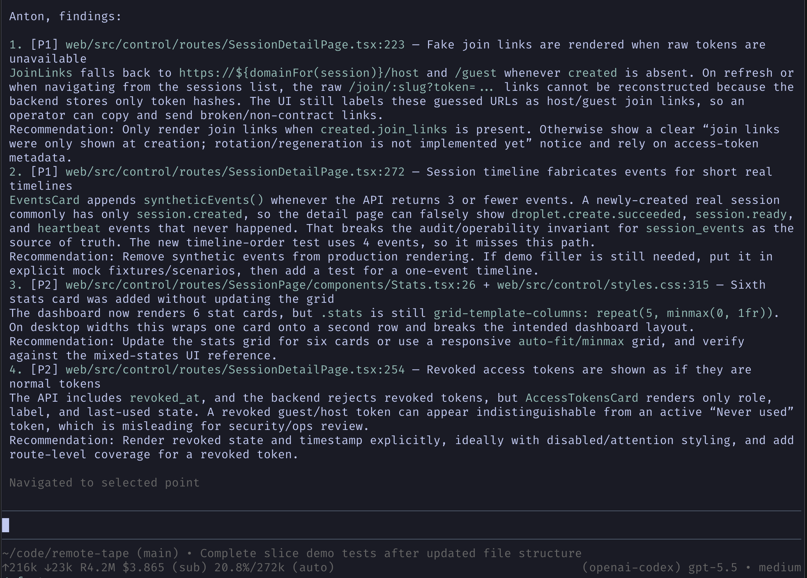

# pi-review

Run a strict maintainer review in a new [pi](https://github.com/badlogic/pi-mono) coding agent branch.

## Preview



## What it does

Adds a `/review` command that starts a new branch from the current conversation and asks pi to review the available work. The review includes user and assistant conversation messages from the current branch, with thinking and tool calls removed.

The reviewer focuses on concrete, high-confidence issues in correctness, security, performance, operability, and maintainability. If nothing material stands out, it reports `looks good`.

## Installation

```bash
pi install npm:pi-review
```

Or try it temporarily:

```bash
pi -e npm:pi-review
```

## Usage

```text
/review
```

Add optional focus text:

```text
/review focus on release safety and backward compatibility
```

After the review finishes, return to the reviewed branch and prefill the editor with the review findings:

```text
/review-back
```

## Configuration

The review thinking level defaults to `high`. Set it globally in `~/.pi/agent/pi-review.json`:

```json
{
  "thinkingLevel": "medium"
}
```

Override it for a project in `<project>/.pi/pi-review.json`. Project configuration takes precedence over global configuration.

Supported values are `off`, `minimal`, `low`, `medium`, `high`, `xhigh`, and `max`. Pi may clamp the configured level to the active model's capabilities.

## How it works

1. Waits for the current agent turn to finish if needed
2. Extracts user and assistant text from the active branch
3. Switches to the configured review thinking level for the review turn
4. Creates a new branch from the current conversation
5. Sends a maintainer-style review prompt with optional focus text
6. Restores your previous thinking level when the review turn ends
7. `/review-back` returns to the reviewed branch and puts the review findings in the editor

## Review output

Findings are sorted by priority:

- `[P0]` severe breakage, data loss, or security issue
- `[P1]` likely user-facing breakage or major regression
- `[P2]` limited-scope correctness, performance, or maintainability issue
- `[P3]` minor but real issue

Each finding includes location, summary, affected behavior/invariant/code path, and a specific recommendation.

## License

MIT
